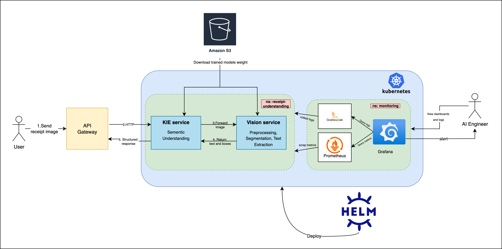
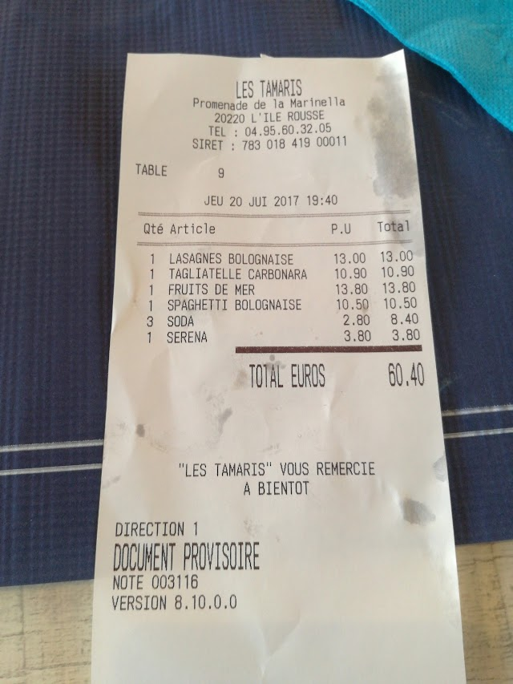
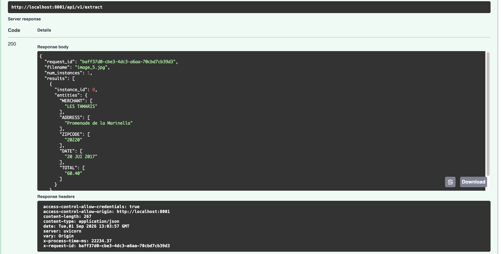
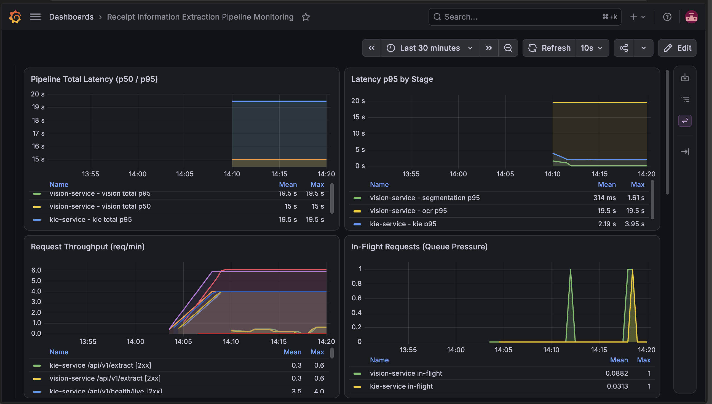
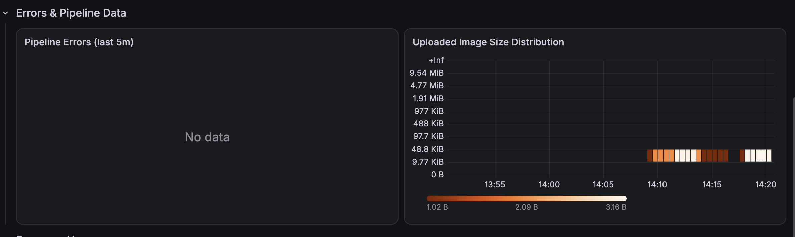
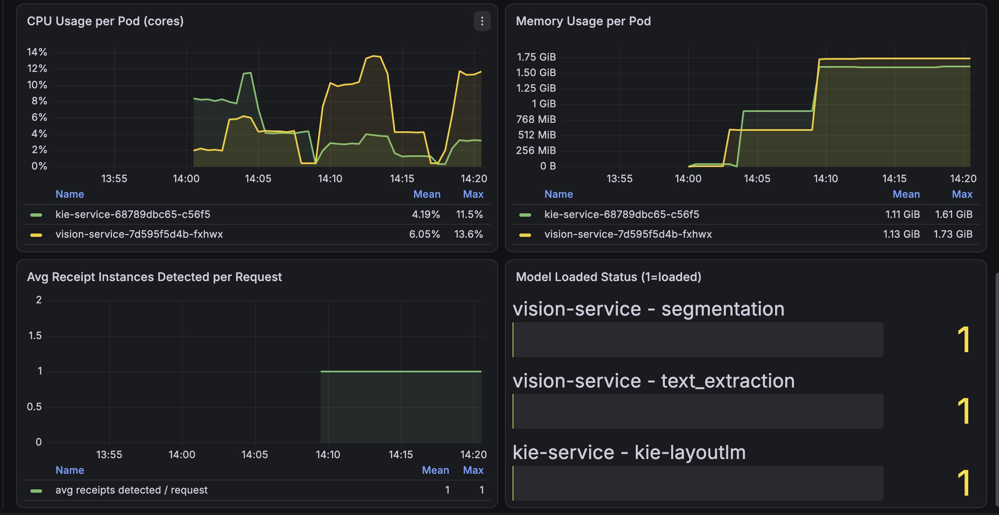
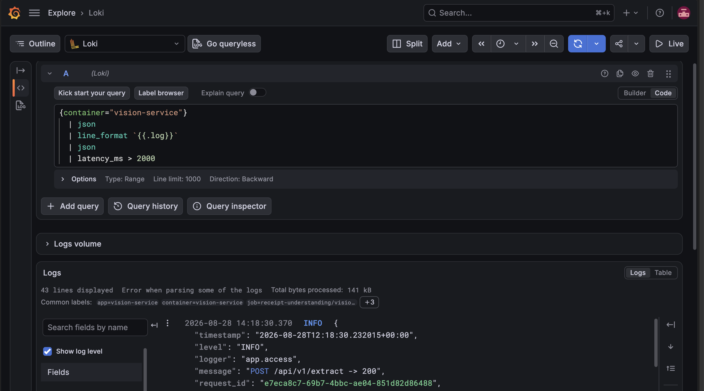

# French Receipt Understanding

An end-to-end, scalable pipeline for extracting key information from French receipt images and scanned documents — built as a set of microservices deployed on Kubernetes, with vision-based document parsing and key information extraction (KIE) models behind a single API.

Architecture diagram


## Overview

Given a photo of a French receipt, the pipeline localizes the receipt, extracts and recognizes the text, and structures it into key fields (merchant, date, total, line items, etc.) — served through a FastAPI gateway and orchestrated across independently scalable microservices on Kubernetes.

## Showcase
### With real tickets


### Monnitor with Grafana
Pipeline performance

Errors tracking

Infrastructure monitoring

Log Tracing

## Flow

```
User → image upload → API endpoint → KIE service
                                         │
                                         ▼
                                  Vision service
                        (preprocess → segmentation → postprocess
                              → text detection → text recognition)
                                         │
                                         ▼
                                    KIE service
                         (layout + text → structured fields)
                                         │
                                         ▼
                                       User
```

1. The user uploads a receipt image to the API.
2. The **KIE service** receives the request and calls the **vision service**.
3. The vision service preprocesses the image, runs **YOLO segmentation** to localize the receipt, then runs **PaddleOCR** text detection and recognition on the segmented region, and postprocesses the results.
4. The vision output (text + layout) is returned to the **KIE service**, which runs **LayoutXLM** to extract structured key-value fields.
5. The structured result is returned to the user.

Logs are shipped to **Loki**, metrics are scraped by **Prometheus**, and both are visualized and queried through **Grafana** dashboards for monitoring and alerting.

## Technology

**Application**
- **API:** FastAPI
- **Model inference:** ONNX Runtime
- **Containerization:** Docker
- **Orchestration:** Kubernetes (K8s)
- **Package management:** Helm

**Data**
- **Storage (model weights):** AWS S3

**Observability**
- **Metrics:** Prometheus
- **Logs:** Loki
- **Dashboards & alerting:** Grafana

## Machine Learning

| Stage | Model |
|---|---|
| Receipt segmentation | YOLO (segmentation) |
| Text detection & recognition | PaddleOCR |
| Key information extraction (KIE) | LayoutXLM |

## Data Sources

- **Receipt segmentation:** [MC-OCR 2021](https://aihub.ml/competitions/430)
- **Key information extraction:** personal dataset of real-world French receipt images

## Project Structure

```
.
├── k8s/                        # Kubernetes manifests & Helm charts
│   ├── helm/
│   ├── kie-service/
│   ├── monitoring/
│   ├── vision-service/
│   ├── 00-namespace.yaml
│   └── DEPLOY.md
├── libs/
│   └── vision_client/           # Shared client library for calling the vision service
├── local_models/                # Local model weights (dev)
├── monitoring/                  # Prometheus / Promtail config for local (docker-compose) monitoring
│   ├── grafana/
│   ├── prometheus.yml
│   └── promtail.yml
├── notebooks/                   # Exploration & experimentation notebooks
├── services/
│   ├── kie-service/              # FastAPI service: orchestration + KIE (LayoutXLM)
│   └── vision-service/           # FastAPI service: segmentation + OCR (YOLO + PaddleOCR)
├── training/                     # Model training pipelines
├── docker-compose.kie.yaml       # Local dev stack (GPU)
├── docker-compose.kie_cpu.yaml   # Local dev stack (CPU)
├── s3_model_download.sh
├── s3_model_upload.sh
└── DEPLOY.md
```

## Design Notes

The pipeline is split into independent microservices (vision, KIE) rather than a single monolith, which keeps it flexible to change:

- The KIE model can be swapped independently — e.g. replacing LayoutXLM with an LLM/VLM-based extractor — without touching the vision service.
- Services can be scaled independently in Kubernetes based on load (e.g. more vision-service replicas for OCR-heavy traffic).
- An API gateway can be introduced in front of the services to support routing, auth, or running multiple KIE/vision implementations concurrently (e.g. for A/B testing a new model).

## Deployment

See [`k8s/DEPLOY.md`](k8s/DEPLOY.md) for Kubernetes/Helm deployment instructions, and the root [`DEPLOY.md`](DEPLOY.md) for local development via Docker Compose.

## Monitoring

Once deployed, Grafana dashboards provide:
- Pipeline latency (p50/p95) and throughput
- Error rates by stage
- Per-pod CPU and memory usage
- Log search and correlation via Loki

See [`k8s/monitoring/`](k8s/monitoring) for the Helm values used to deploy the `kube-prometheus-stack` and `loki-stack`.
