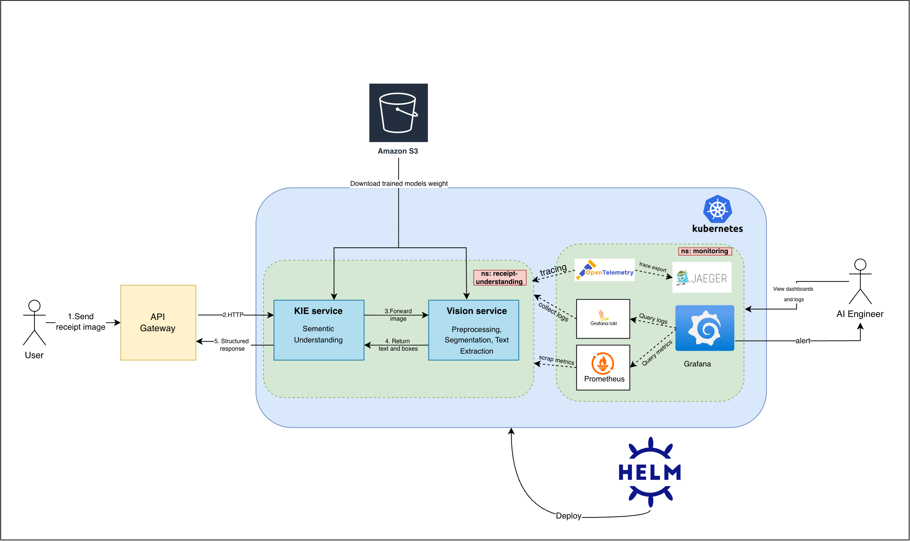
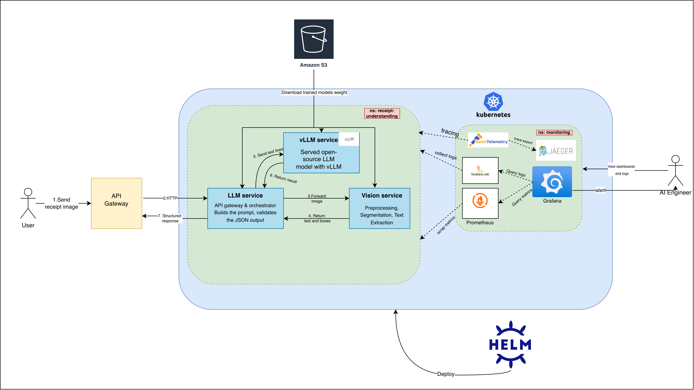
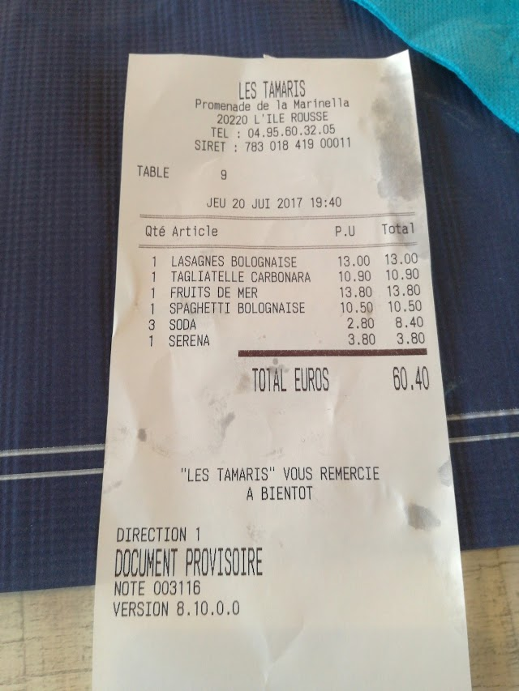
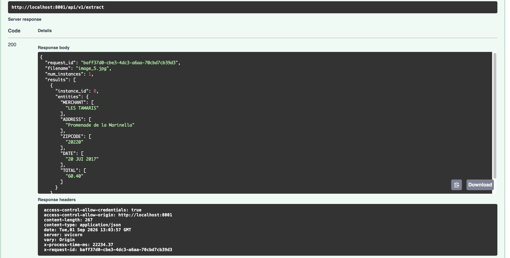
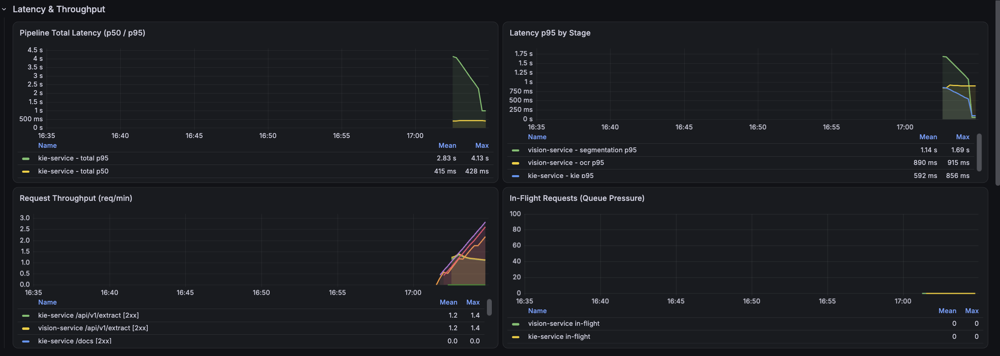
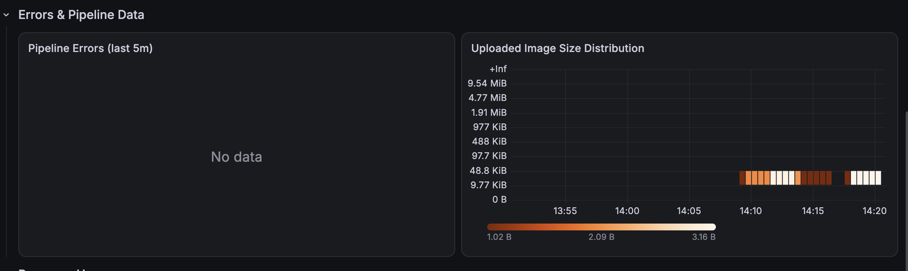
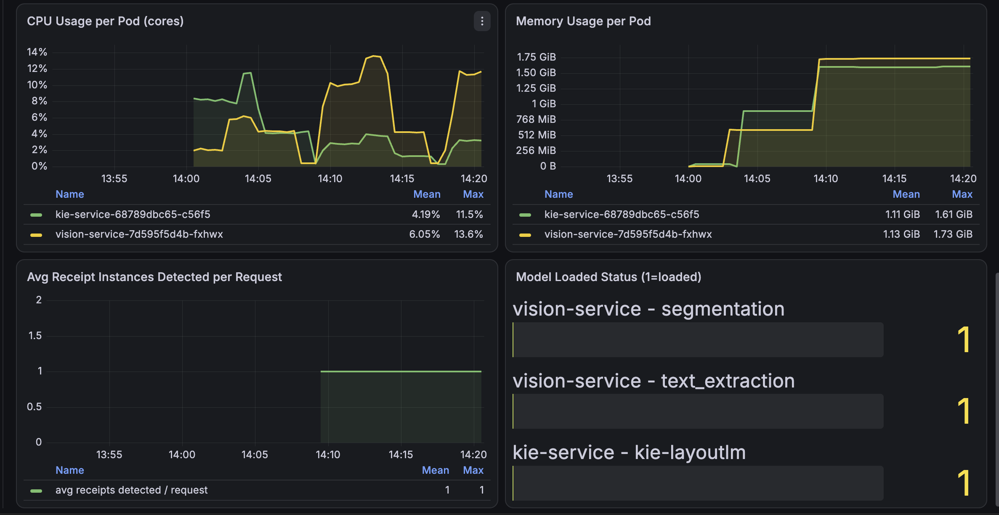
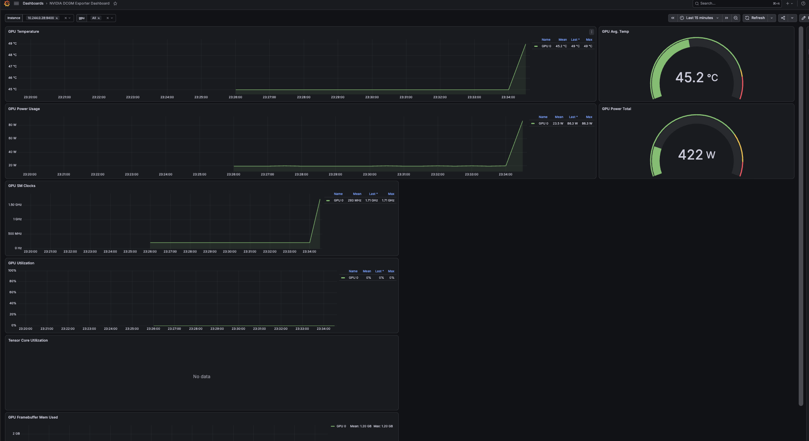
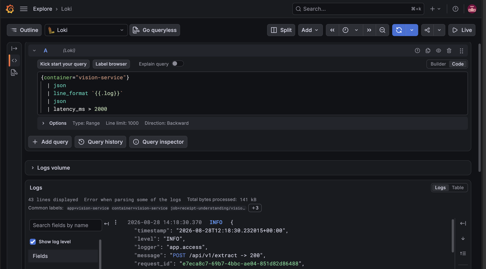
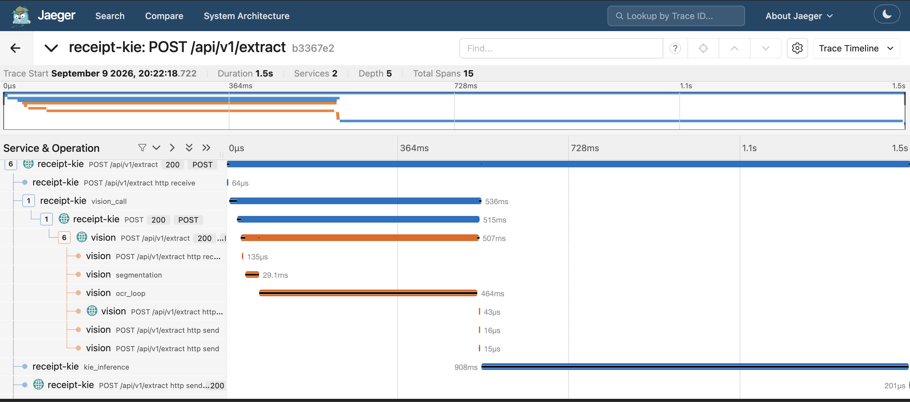

# French Receipt Understanding

An end-to-end, scalable pipeline for extracting key information from French receipt images and scanned documents. It is built as a set of microservices deployed on Kubernetes, with vision-based document parsing and a pluggable key information extraction (KIE) module behind a single API.

Two extraction modules are supported and can be switched at deploy time:

- **`kie`**: traditional layout-aware model (LayoutXLM)
- **`llm`**: self-hosted open-weight LLM (Qwen2.5-7B-Instruct) served with vLLM

Architecture diagrams

With traditional KIE model


With LLM


## Overview

Given a photo of a French receipt, the pipeline localizes the receipt, extracts and recognizes the text, and structures it into key fields (merchant, date, total, line items, etc.). It is served through a FastAPI gateway and orchestrated on Kubernetes.

## Showcase
### With real tickets


### Monitoring with Grafana
Pipeline performance with RTX 3060

Errors tracking

Infrastructure monitoring

GPU monitoring

Log Tracing

Jaeger profiling tracing


## Flow

### Module `kie` (LayoutXLM)

```
User → image upload → API endpoint → KIE service
                                         │
                                         ▼
                                  Vision service
                        (preprocess → segmentation → postprocess
                              → text detection → text recognition)
                                         │
                                         ▼
                                    KIE service
                         (layout + text → structured fields)
                                         │
                                         ▼
                                       User
```

1. The user uploads a receipt image to the API.
2. The **KIE service** receives the request and calls the **vision service**.
3. The vision service preprocesses the image, runs **YOLO segmentation** to localize the receipt, then runs **PaddleOCR** text detection and recognition on the segmented region, and postprocesses the results.
4. The vision output (text + layout) is returned to the **KIE service**, which runs **LayoutXLM** to extract structured key-value fields.
5. The structured result is returned to the user.

### Module `llm` (vLLM)

```
User → image upload → API endpoint → LLM service
                                         │
                                         ▼
                                  Vision service
                        (preprocess → segmentation → postprocess
                              → text detection → text recognition)
                                         │
                                         ▼
                                    LLM service
                              (builds prompt from OCR text)
                                         │
                                         ▼
                                    vLLM service
                     (Qwen2.5-7B-Instruct AWQ, OpenAI-compatible API)
                                         │
                                         ▼
                                    LLM service
                           (validates JSON → structured fields)
                                         │
                                         ▼
                                       User
```

1. The user uploads a receipt image to the API.
2. The **LLM service** (orchestrator) receives the request and forwards the image to the **vision service**.
3. The vision service returns the recognized text and boxes, as in the `kie` flow.
4. The LLM service builds a prompt from the OCR output and sends it to the **vLLM service**, which hosts the open-weight model and exposes an OpenAI-compatible API (`/v1/chat/completions`).
5. The model returns the extracted fields as JSON, which the LLM service validates and returns to the user.

Logs are shipped to **Loki** and metrics are scraped by **Prometheus**, both of which are visualized and queried through **Grafana** for monitoring and alerting. Distributed traces are captured by **Jaeger** and analyzed using the dedicated Jaeger UI for low-latency request tracking and span inspection.

## Technology

**Application**
- **API:** FastAPI
- **Model inference:** ONNX Runtime (vision, KIE), vLLM (LLM)
- **Containerization:** Docker
- **Orchestration:** Kubernetes (K8s)
- **Package management:** Helm

**Data**
- **Storage (model weights):** AWS S3

**Observability**
- **Metrics:** Prometheus
- **Logs:** Loki
- **Tracing:** Jaeger
- **Dashboards & alerting:** Grafana

## Machine Learning

| Stage | Model |
|---|---|
| Receipt segmentation | YOLO (segmentation) |
| Text detection & recognition | PaddleOCR |
| Key information extraction (module `kie`) | LayoutXLM |
| Key information extraction (module `llm`) | Qwen2.5-7B-Instruct (AWQ 4-bit) served with vLLM |

## Data Sources

- **Receipt segmentation:** [MC-OCR 2021](https://aihub.ml/competitions/430)
- **Key information extraction:** personal dataset of real-world French receipt images

## Project Structure

```
.
├── k8s/                        # Kubernetes manifests & Helm charts
│   ├── helm/
│   │   └── receipt-understanding/   # Chart: module=kie | llm
│   ├── kie-service/
│   ├── monitoring/
│   ├── vision-service/
│   ├── 00-namespace.yaml
│   └── DEPLOY.md
├── libs/
│   └── vision_client/           # Shared client library for calling the vision service
├── local_models/                # Local model weights (dev)
├── monitoring/                  # Prometheus / Promtail config for local (docker-compose) monitoring
│   ├── grafana/
│   ├── prometheus.yml
│   └── promtail.yml
├── notebooks/                   # Exploration & experimentation notebooks
├── services/
│   ├── kie-service/              # FastAPI service: orchestration + KIE (LayoutXLM)
│   ├── llm-service/              # FastAPI service: orchestration + LLM-based extraction
│   ├── vllm-serve-service/       # vLLM server image + model weights (Qwen2.5-7B AWQ)
│   └── vision-service/           # FastAPI service: segmentation + OCR (YOLO + PaddleOCR)
├── training/                     # Model training pipelines
├── docker-compose.kie.yaml       # Local dev stack (GPU)
├── docker-compose.kie_cpu.yaml   # Local dev stack (CPU)
├── s3_model_download.sh
├── s3_model_upload.sh
└── DEPLOY.md
```

## Design Notes

The pipeline is split into independent microservices (vision, KIE / LLM) rather than a single monolith, which keeps it flexible to change:

- The extraction module can be swapped independently, from LayoutXLM to an LLM served with vLLM, without touching the vision service. This is already implemented and selected with a single Helm value.
- Services can be scaled independently in Kubernetes based on load (e.g. more vision-service replicas for OCR-heavy traffic).
- The vLLM server is deployed in the same namespace and Helm release as the other services, so it is reachable at `http://vllm-service:8000/v1` and shares the same lifecycle and monitoring.
- An API gateway can be introduced in front of the services to support routing, auth, or running multiple KIE/vision implementations concurrently (e.g. for A/B testing a new model).

### Choosing a module

| | `kie` (LayoutXLM) | `llm` (vLLM) |
|---|---|---|
| Approach | Fine-tuned layout-aware model | Prompted open-weight LLM |
| Needs labeled data | Yes | No (prompt-based) |
| GPUs (K8s) | 1 (vision) | 2 (vision + vLLM), unless GPU sharing is configured |
| Extra components | None | vLLM server, model weights volume |

## Deployment

Select the module with the `module` Helm value (`kie` by default):

```bash
# LayoutXLM
helm install receipt ./k8s/helm/receipt-understanding --set module=kie

# LLM + vLLM
helm install receipt ./k8s/helm/receipt-understanding --set module=llm
```

With `module=llm`, the chart deploys `llm-service` and `vllm-service` instead of `kie-service`. The vLLM pod requests one GPU and loads the AWQ model weights from a persistent volume; make sure the cluster has enough GPUs for both the vision and vLLM pods.

See [`k8s/DEPLOY.md`](k8s/DEPLOY.md) for Kubernetes/Helm deployment instructions, and the root [`DEPLOY.md`](DEPLOY.md) for local development via Docker Compose.

## Monitoring

Once deployed, Grafana dashboards provide:
- Pipeline latency (p50/p95) and throughput
- Error rates by stage
- Per-pod CPU and memory usage
- Log search and correlation via Loki
- Per GPU information (usage, temperature, etc.)
- vLLM metrics (exposed at `/metrics`) when `module=llm`

The Jaeger UI provides tracing to check per-request latency.

See [`k8s/monitoring/`](k8s/monitoring) for the Helm values used to deploy the `kube-prometheus-stack` and `loki-stack`.